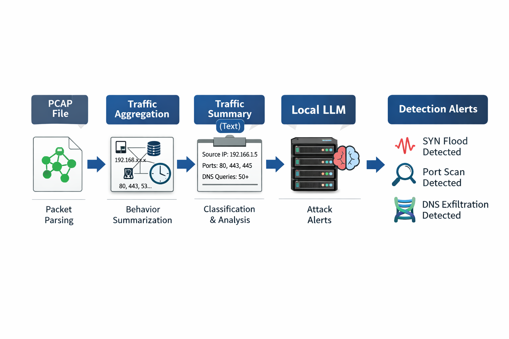

# 🛡️ PCAP-Based Intrusion Detection Using a Local LLM 🤖

## 📌 Project Overview

This project analyzes network traffic captured in **PCAP files** to identify potential cyber attacks. It focuses on detecting three specific attack types:

- 🌊 **SYN Flood**
- 🔍 **Port Scanning**
- 🗄️ **DNS Exfiltration**

The system combines **traditional packet analysis and traffic aggregation** with a **locally hosted Large Language Model (LLM)**. The LLM is used to classify and explain suspicious network behavior based on summarized traffic patterns.

All processing is performed **locally**, without reliance on cloud-based APIs, ensuring 🔐 **data privacy**.

---

## 🏗️ System Architecture

Figure 1: System architecture for PCAP-based intrusion detection using traffic aggregation and a local LLM for classification and explanation.

---

## ✨ Key Features

- 📦 Parses PCAP files using packet inspection  
- 📊 Aggregates traffic by IP addresses, ports, DNS queries, and time  
- 🚨 Detects SYN floods, port scans, and DNS exfiltration  
- 🤖 Uses a **local LLM** for attack classification and reasoning  
- 📝 Produces human-readable explanations for detected attacks  

---

## 🧠 Attack Detection Approach

### 🌊 SYN Flood Detection
- Aggregates TCP traffic by source and destination IP  
- Tracks the number of TCP SYN and ACK packets  
- Summarizes traffic duration and packet imbalance  
- LLM determines whether the behavior matches a SYN flood  

### 🔍 Port Scan Detection
- Aggregates TCP traffic by source IP  
- Tracks the number of unique destination ports contacted  
- Summarizes scanning behavior over time  
- LLM determines whether the behavior matches a port scan  

### 🗄️ DNS Exfiltration Detection
- Aggregates DNS queries by source IP  
- Tracks query frequency and query length  
- Highlights unusually long or frequent DNS queries  
- LLM determines whether the behavior matches DNS exfiltration  

---

## 🤖 Role of the Local LLM

The LLM is used as a **semantic classification and explanation layer**, not as a low-level packet classifier.

Specifically, the LLM:
- Receives summarized traffic descriptions  
- Classifies traffic as one of:
  - 🌊 SYN Flood  
  - 🔍 Port Scan  
  - 🗄️ DNS Exfiltration  
  - ✅ Benign  
- 🧾 Generates natural-language explanations describing its reasoning  

This design improves interpretability while keeping detection efficient and modular.

---

## 🧾 Practical Labs & Domain Knowledge

This project was developed and refined through hands-on lab exercises. Below are concise domain insights, heuristics, and practical tips learned during those labs — useful when interpreting PCAPs, choosing features, and tuning detection thresholds.

- **SYN Flood indicators**:
  - High rate of TCP SYN packets from one or few sources to a target with few or no corresponding ACKs.
  - Short burst durations with large SYN/ACK imbalance.
  - Typical lab validation: generate controlled SYN floods and verify spikes in `syn` counters and minimal `ack` responses.

- **Port scan indicators**:
  - Single source contacting many destination ports (sequential or random) within a short window.
  - Small packet sizes, few payloads, and repeated SYNs to many different `dport` values.
  - Practical threshold: treat >100 unique destination ports per minute as suspicious (adjust for environment).

- **DNS exfiltration indicators**:
  - High frequency of DNS queries from a host to uncommon domains, with unusually long query names or high label entropy.
  - Repeated queries with payload-like strings encoded in subdomains (base32/base64 patterns).
  - Lab exercise: craft long qnames and observe aggregation by source IP and query length distributions.

- **Feature extraction tips**:
  - Use packet timestamps as floats (seconds since epoch) and convert to `float` explicitly when aggregating.
  - Collect both counts (SYN/ACK) and temporal features (first/last timestamps, inter-arrival statistics).
  - Track both per-(src,dst) flows and per-src aggregates; some attacks are distributed and require different aggregation scopes.

- **LLM prompt & validation notes**:
  - Keep LLM inputs as concise summaries (counts, time window, sample ports/queries); avoid raw PCAP dumps.
  - Use deterministic prompt templates and include expected JSON output structure for reliable parsing.
  - Validate LLM outputs against rule-based heuristics before acting in automated workflows.

- **Common pitfalls observed in labs**:
  - Timestamp arrays may contain non-primitive types; convert values with `float()` before using `numpy.mean()` to avoid type errors.
  - Small lab PCAPs may not reflect baseline noise present in production; tune thresholds conservatively.
  - False positives from benign heavy scanners (vulnerability assessment tools) — correlate with known inventory and scheduled scans.

- **Recommended lab exercises**:
  - Generate a controlled SYN flood and inspect `syn` vs `ack` ratios and durations.
  - Run sequential and random port scans from a test host and observe unique port counts and timing patterns.
  - Craft DNS queries with encoded payloads to see how query length and entropy metrics behave.

These practical observations guided the choice of aggregation metrics, summary formats, and prompt designs used across this repository.

---

